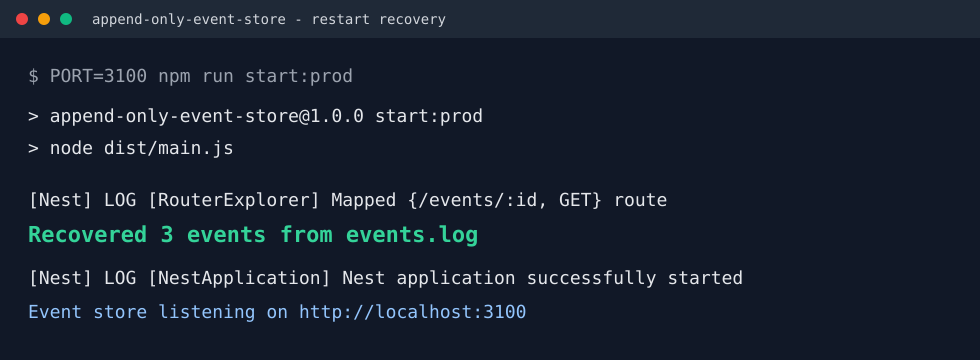

# Append-Only Event Store

A small NestJS HTTP service that stores JSON events in an append-only log file and rebuilds its in-memory index after restart.

The log file is the database. There is no SQLite, MongoDB, or rewritten JSON file.

## Tech Stack

- Node.js
- NestJS
- TypeScript
- Plain file storage: `events.log`

## Setup

```bash
npm install
npm run build
npm run start:prod
```

The server runs on `http://localhost:3000` by default.

Use another port if needed:

```bash
PORT=3100 npm run start:prod
```

## API

### Create an Event

```bash
curl -s -X POST http://localhost:3000/events \
  -H "Content-Type: application/json" \
  -d '{"type":"signup","user":"Ada"}'
```

Response:

```json
{
  "type": "signup",
  "user": "Ada",
  "id": "3bd5d6bf-7423-4c20-940f-ac2bebfba4b0",
  "createdAt": "2026-06-01T19:51:04.348Z"
}
```

### Read an Event by ID

```bash
curl -s http://localhost:3000/events/3bd5d6bf-7423-4c20-940f-ac2bebfba4b0
```

If the ID is not in the in-memory index:

```bash
curl -i http://localhost:3000/events/not-real
```

Returns `404`.

### Stats

```bash
curl -s http://localhost:3000/stats
```

Response:

```json
{
  "total": 3,
  "bytes": 384
}
```

## Architecture

```text
POST /events
    |
    v
NestJS Controller
    |
    v
EventsService
    |
    | 1. Generate UUID v4
    | 2. Add createdAt timestamp
    | 3. JSON.stringify(event) + "\n"
    v
Append to events.log ----------------+
    |                                |
    |                                v
    |                         Map<id, { offset, length }>
    |                                ^
    |                                |
    +---- current byte offset --------+


GET /events/:id
    |
    v
Map lookup by id
    |
    | offset + length
    v
fs.read exactly that byte range from events.log
    |
    v
JSON.parse and return event
```

On startup:

```text
events.log -> stream line by line -> calculate byte offsets -> rebuild Map index
```

## Core Concepts

Append-only storage is safer than overwriting in place because each write adds a complete new line at the end of the file. If the process dies during normal operation, older events are still untouched. There is no large file rewrite where one failed write can corrupt the whole database.

The in-memory index makes reads fast because the server does not scan `events.log` for every request. Each event ID points to `{ offset, length }`, so `GET /events/:id` can seek directly to the right byte range and read only that event.

Unicode is handled with `Buffer.byteLength(...)`, not JavaScript string length, because offsets in files are byte offsets.

## Recovery Log Screenshot



The important startup line is:

```text
Recovered 3 events from events.log
```

## Restart Test

1. Start the server.
2. Create a few events and copy their IDs.
3. Stop the server with `Ctrl+C`.
4. Start the server again.
5. Confirm the startup log says the correct recovered count.
6. Read every copied ID with `GET /events/:id`.

Example verified locally:

```text
POST /events -> 201 3bd5d6bf-7423-4c20-940f-ac2bebfba4b0
POST /events -> 201 338ed3cc-aa71-48df-ac1e-23a995587b8c
POST /events -> 201 6ba539cd-a121-4a8c-a757-a91211c047be
Restart
Recovered 3 events from events.log
GET each ID -> 200
GET /events/not-real -> 404
GET /stats -> {"total":3,"bytes":384}
```

## What I Struggled With

- Tracking `offset` and `length` correctly needed byte lengths, not normal string lengths. This matters for unicode payloads.
- I had to make sure reads do not scan the file. The index stores the exact byte position so reads use `FileHandle.read(...)`.
- Concurrent writes can race if two requests calculate the same current offset at the same time. I fixed that with a simple promise-based write queue inside `EventsService`.
- Recovery needed to rebuild the whole index from only `events.log`, so the log line format had to stay one JSON object per line.

## What I Learned

- Append-only logs are a simple version of how databases protect writes before updating indexes.
- File offsets are byte-based, so unicode changes the calculation if you use the wrong length method.
- A fast read path can be built from a small in-memory index without adding a database.
- NestJS lifecycle hooks are useful for startup recovery and shutdown cleanup.

## Resources Consulted

- NestJS documentation: https://docs.nestjs.com/
- Node.js `fs/promises` documentation: https://nodejs.org/api/fs.html#fspromisesopenpath-flags-mode
- Node.js `Buffer.byteLength` documentation: https://nodejs.org/api/buffer.html#static-method-bufferbytelengthstring-encoding
- Node.js `crypto.randomUUID` documentation: https://nodejs.org/api/crypto.html#cryptorandomuuidoptions
- AI assistance: used to reason about byte offsets, recovery flow, and README structure.

## Why This Made Me a Better Backend Developer

This project made persistence mechanics more concrete for me. I can now explain how a write-ahead style log survives restarts, why indexes are separate from storage, and why correctness details like byte offsets matter. In production systems, I will pay closer attention to crash recovery, append-only write paths, and the difference between storing data safely and reading it quickly.

## Demo Video Checklist

Keep the recording under 30 seconds:

1. Show the server starting.
2. POST two or three events.
3. Copy or display the returned IDs.
4. Stop the server.
5. Restart and show `Recovered N events from events.log`.
6. GET the old IDs successfully.
7. Optionally show `GET /stats`.
